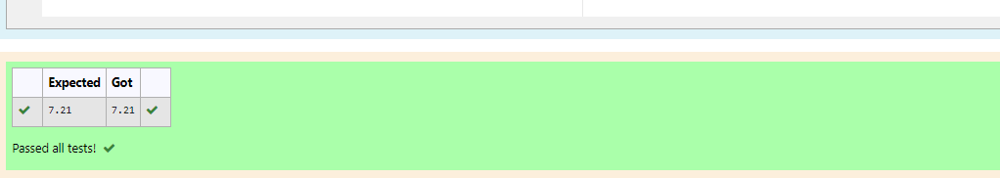

# DISTANCE-BETWEEN-TWO-POINTS
```
## AIM:
To write a python program to find the distance two 2 points
## ALGORITHM:
### Step 1: 
Import the numpy module to use the built in function for calculation.
### Step 2: 
Prepare lists from each linear equations and assign in np.array()
### Step 3: 
Substitute the values in the distance formula  
### Step 4: 
Print the val format.
### Step 5:
End the program. 
### PROGRAM:
#Program to find the distance between two points.
#Developed by:MS.Jeeva
#RegisterNumber:21500143
x1,x2=10,4
y1,y2=6,2
import math
value=math.sqrt((x2-x1)**2+(y2-y1)**2)
print("{:.2f}".format(value))
```
  


### OUTPUT:



### RESULT:
Thus a python program to find the distance two 2 points is obtained.